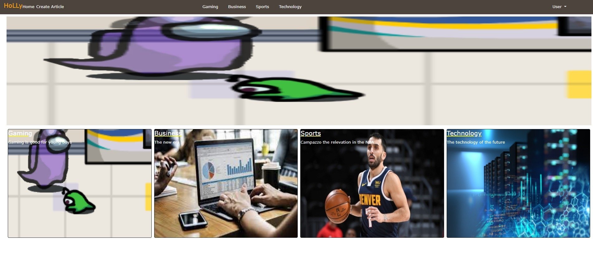
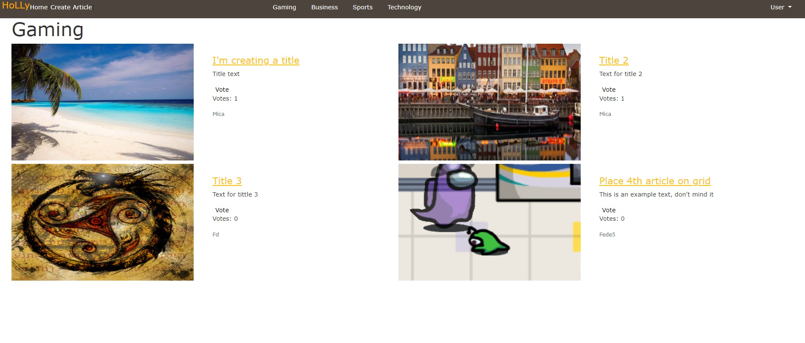
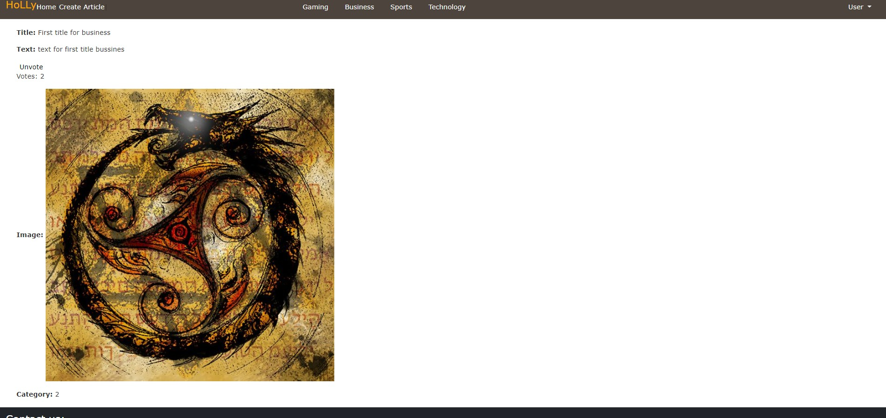

<!-- ABOUT THE PROJECT -->

## About The Project

This is the Capstone project that signs the completion of the RubyOnRails module in the Microverse Curriculum.
It is a web app where users can sign up, sign in, log out and create articles.
As a logged in user, it is possible to create articles and vote on articles.





### Built With

- Ruby & Ruby on Rails
- Rspec / Capybara
- Bootstrap
- HTML / CSS / SCSS
- PostgreSQL
- Rubocop

<!-- Live Demo -->

## Deployment (Heroku)

- Live Demo Link --> [rails-capstone](https://whispering-journey-14460.herokuapp.com/) :point_left:

### Getting Started

To get a local copy up and running follow these simple example steps.

### Prerequisites

- Ruby: 2.7
- Rails: 6.1.3.1
- PostgreSQL is necessary
- Install Yarn

### Clone

- Clone with HTTPS

```
 https://github.com/FdI96/LifeStyleArticle.git
```

### Setup

Install gems with:

```
$ bundle install
```

Setup database with:

```
$ rails db:create before migration
$ rails db:migrate (creates and migrates the database)
$ rails db:seed    (seeds the database with default values)
$ rake database:correction_seq_id  (corrects the postgreSQL sequence after seed)
```

### Usage

Start server with:

```
$ rails server
```

Open `http://localhost:3000/` in your browser and click sign up to create a new user.

- for any technical problems running `rails db:migrate:reset && rails db:seed && rake database:correction_seq_id ` should solve it

#### Sign Up and Log In

Fill the sign up form to create a user

#### Create a new article

Type the title, text, upload an image and put it under a category.

## Automated Test

- Run the command and see the output:
  `$ bundle exec rspec`

## Database Structure

- Database schema used for this project reflects the following structure:
  

## Potential future features

- Extend the signin / signup process to social accounts, use verfied email process
- Improve the front-end

<!-- CONTACT -->

## Contributors

👤 **Federico Ignacio Lopez Cechini**

- GitHub: [@FdI96](https://github.com/FdI96)
- Twitter: [@federicolopezc7](https://twitter.com/federicolopezc7)
- LinkedIn: [Federico Ignacio Lopez Cechini](https://www.linkedin.com/in/federico-ignacio-lopez-cechini-3285411a4/)

## :handshake: Contributing

Contributions, issues and feature requests are welcome!

Feel free to check the [issues page](https://github.com/FdI96/LifeStyleArticle/issues).

## Show your support

Give a :star: if you like this project!

<!-- ACKNOWLEDGEMENTS -->

## Acknowledgements

- [Microverse](https://www.microverse.org/)
- [Ruby Documentation](https://www.ruby-lang.org/en/documentation/)
- [Ruby on Rails](https://rubyonrails.org/)
- [Bootstrap](https://getbootstrap.com/)
- [Behance](https://www.behance.net/)
- [Heroku](https://www.heroku.com/)

## Credits

- Nelson Sakwa - [liFEstIye](https://www.behance.net/gallery/14554909/liFEsTlye-Mobile-version)

## 📝 License

This project is [MIT](https://github.com/FdI96/LifeStyleArticle/blob/develop/LICENSE) licensed.
